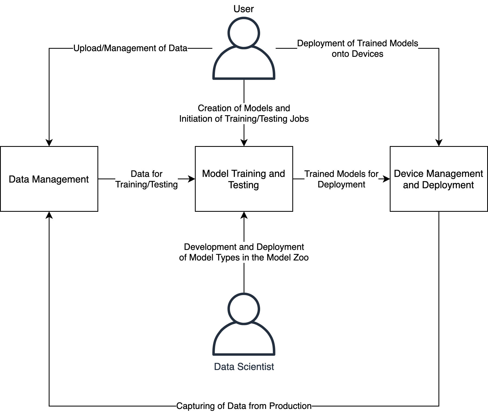

# Overview

The Platform is designed to support three essential workloads related to the use of AI in production scenarios: data management, model training/testing, and deployment of validated models. The diagram below shows a high-level representation of the different workloads supported by the Platform.

The documentation of the Platform is organized into four sections: one for each of the workloads of the Platform as well as a dedicated section for data scientists who wish \(1\) to make use of data in the Platform for local development or \(2\) develop models that can be published in the Model Zoo and be used by \(non-technical\) users—such as inspection specialists, operators, QA professionals, and others.

Go to one of the sections of the documentation to learn more about the Platform:

* [Data management](docs/data-management/intro.md)
* [Model training and testing](docs/model-training-and-testing/intro.md)
* [Device management](docs/device-management/intro.md)
* [Technical documentation \(for data scientists\)](docs/developers/intro.md)

If you have any questions about the Platform that is not answered by our documentation, please do not hesitate to reach out to our support team: [support@brevetti.ai](mailto:support@brevetti.ai)

