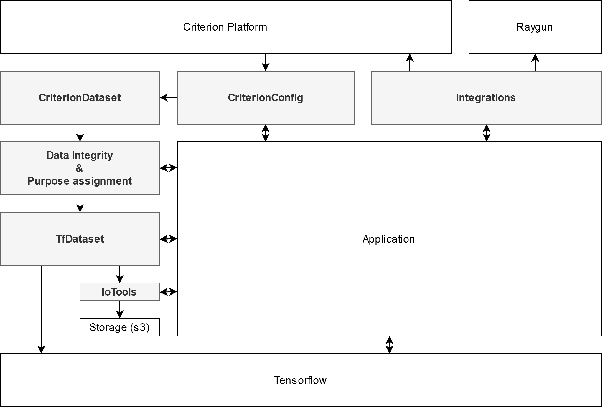

# Python SDK - Brevetti AI package

## Who should use brevettiai package?

* You are a data-scientist who works with the Brevetti AI platform
* You are managing data on Brevetti AI platform and want to automate parts of your workflow

## Why should you use Brevetti AI package? 

As a data-scientist you provide value to your organization, by managing and using data to create actionable information, or models to automate tasks. To do this you need tooling to manage data, experiments, and models in a structured way.  

The Brevetti AI platform aims to provide the framework to work with your data in a regulated context. The Brevetti AI package aims to provide the tooling that makes it easy for the data-scientist to work with the platform along with a number of tools for getting / managing and exploring the data and results of your experiments.  

As data manager the amounts of data for deep learning sometimes give rise to repetitive tasks. Brevetti AI Web API is a way to automate these.

## What does the Brevetti AI package \(brevettiai\) give me?

A way to integrate your normal development workflows with the Brevetti AI platform, and a number of tools to do support you with loading, managing and exploring data and models. \(Web API\)

Additionally the Brevetti AI package helps you write code to train models on the platform, by providing interfaces that work with the platform when you are running experiments locally and deploy to run remotely in the cloud. \(Job API\)

The Brevetti AI package contains 3 parts.

* Web API Python interface on top of the web page to automate the task you can perform on the website.
* Job API Lower level API for running experiments and developing model / test report code.
* Data-science tools A nuber of prebuilt tools to help you work faster with the data. Data loading, splitting, sampling, augmentation, etc.

