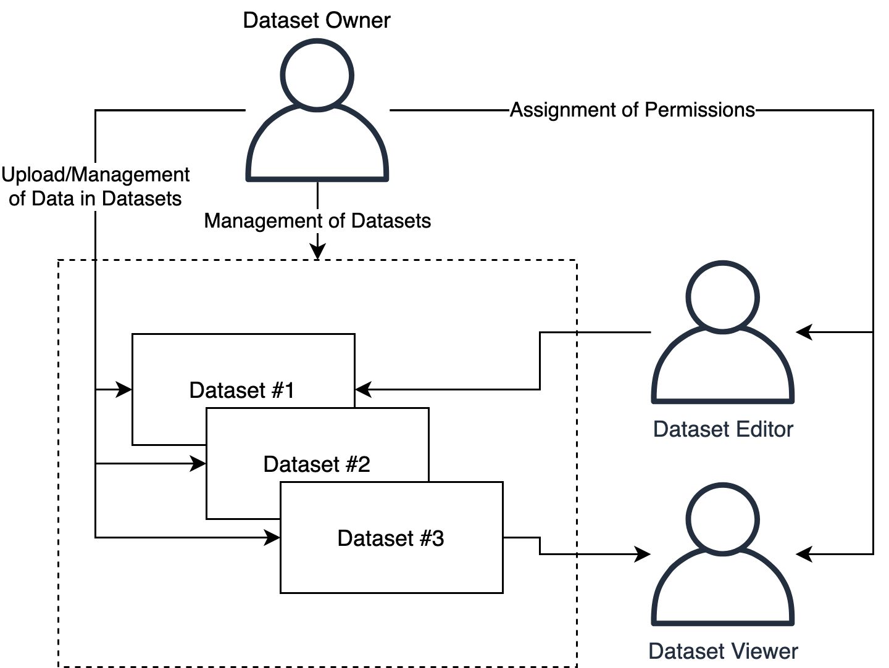

# Introduction

The Platform lets users create, manage, or participate in datasets, which work as spaces for hosting any kind of data—such as images, documents, sound files, tables, and more. At its core, a dataset in the Platform is a designated space \(hosted by [Amazon S3](https://aws.amazon.com/s3/)\) that described by a name, a purpose, and a range of tags while being controlled by the role-based access control system built into the Platform.

