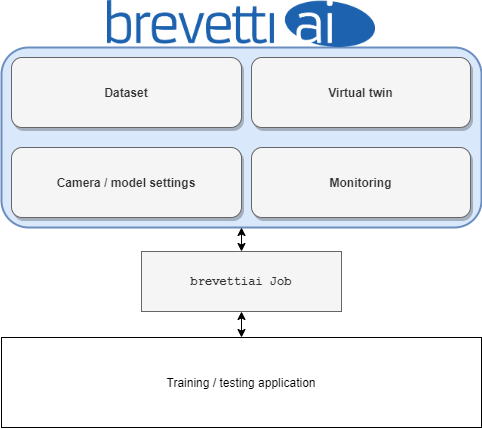

# Job API

The Job API is your execution context when running a job on the platform. A job being defined as a model training process, or the process of creating a test report.

It provides a python interface to the website, and keeps track of the resources you have available there, and parsing of input in the form of settings to your code.



From the platform, a job \(model or test report\) is an input configuration with a storage space attached. The storage space freely available to use by the job, but following a few conventions, allows the platform to parse specific content for display on the model page.


##Job object
A Job in the python code is collected into a single object containing its state and settings at runtime. you can use the Job object directly, or subclass it to add your own functionality.
Settings may be added to a job by subclassing the Job object, and changing the settings parameter type to a settings object to a new JobSettings object.
from brevettiai import Job, JobSettings

```python
class MyJobSettings(JobSettings):
    my_custom_int_setting: int
    
class MyJob(Job):
    settings: MyJobSettings
    
    def run():
        print(f"My setting is {self.my_custom_setting})
        return None

job = MyJob.init(job_id='UUID', api_key='key')
job.start()
```


Settings may themselves subclass JobSettings, pydantic BaseModel, pydantic dataclasses or python dataclasses. 
resulting in a tree of settings.
Like the job_id and apikey the settings may be set from argv using a dot notation (`--setting_name.sub_setting 42`).
for the job above, this may be set as `--my_custom_int_setting 37`. To add information about the field,
use the pydantic Field class as default value. 

##Job lifecycle
###Initialize
To begin executing a job you first need do get an execution context. retrieving settings datasets, access rights, etc.
to do this you call the init function on a brevetti Job object.
```python
from brevettiai import Job
job = Job.init()
```
The init function can use either arguments on the function or command line
arguments `--job_id` and `--api_key` to find the job on the brevetti ai platform

### Start
The Job is started by running the start the start function.
By default this will upload a job output json file to the job, call the run function, and then complete the job.
Overwrite the `Job.run()` function to perform the job you would like,
returning a path to where the output model file is at the end. See example in the Job object section above.