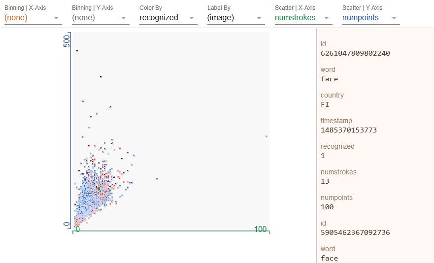

# Job API Interfaces

The Job aoe object works as a link between the platform and the python training/testing application code - all provided by essentially two lines of code.
* The platform provides user interface and meta data for a user to select datasets for a Job - the data is accessible through the job object.
* The platform let's the user select the training job settings such as image resolution.
* Models and reports support a number of different visualization types on the platform.

## Brevetti AI data access API
### Dataset browsing
```
from brevettiai.platform import get_image_samples
samples = get_image_samples(job.datasets)
```
### Platform file access
Write and read files on cloud artifact directory
```
artifact_path = job.artifact_path("my_info.txt")
job.io.write_file(artifacts_path, "Valuable information")
info = job.io.read_file(artifact_path)
```
### Sample integrity tracking?
```
from brevettiai.data.sample_integrity import SampleSplit
samples = SampleSplit().update_unassigned(samples, id_path=job.artifact_path("sample_identification.csv"))
```
## Brevetti AI Job settings API
The platform let's the user select the training job settings such as image resolution.

The ```Job.Settings``` and derived objects have the ```get_schema()``` method that produces a settings schema to be added to the model during creation of a new *model type* for the Model Zoo.
   
The ```settings``` attribute of a job instance will have the settings and objects specififed by the platform user.

## Brevetti AI visualization API's
### Pivot tables

Use pivot tables to get an overview over the contents of your job. Export pivot table information files to the pivot directory of the artifact dir.

```text
from brevettiai.interfaces.pivot import export_pivot_table, get_default_fields, pivot_fields
export_pivot_table(job.artifact_path("pivot", dir=True), samples,
                   datasets=job.datasets,
                   fields=None,
                   tags=job.get_root_tags(),
                   rows=["dataset_id"],
                   cols=["category"],
                   agg={"url": "first"})
```

### Progress monitoring \(Models only\)

Add progress metrics to monitor your models while it is running, by adding the RemoteMonitor callback to your keras training loop or call it yourself in your training code.

```text
from brevettiai.interfaces.remote_monitor import RemoteMonitor
callback = RemoteMonitor(root=job.host_name, path=job.api_endpoints["remote"])
```

### HTML

Add your own custom html reports. All HTML files present in the root of the artifacts directory will be shown with the model and test reports.

### Facets Dive

Use [Facets Dive](https://pair-code.github.io/facets/) to explore your data interactively.



Use the facets implementation tool with the image datasets to generate your own facets charts, and put the files in the facets folder in your artifacts.

To use the built-in tools you need to supply a DataGenerator which outputs a 64x64 thumbnail image, and category.

```text
from brevettiai.data.data_generator import DataGenerator
from brevettiai.interfaces.facets_atlas import build_facets

fds = DataGenerator(samples, shuffle=True, output_structure=("img", "category")) \
    .map(ImagePipeline(target_size=(64,64), antialias=True))

build_facets(fds, job.artifact_path("facets", dir=True), count=32)
```

### Vega-Lite charts

Add [Vega-Lite charts](https://vega.github.io/vega-lite/) to your model page by calling upload\_chart on the configuration object. Some different standard charts are available under `brevettiai.interfaces.vegalite_charts`

```text
from brevettiai.interfaces import vegalite_charts

vegalite_json = vegalite_charts.dataset_summary(samples)
job.upload_chart(vegalite_json)
```
