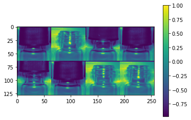
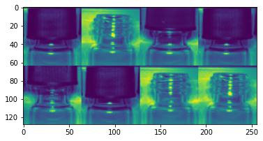
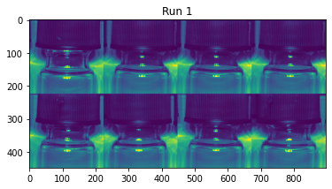

# Introduction to Brevetti AI Job API
The brevettiai Job API is your execution context when running a job on the platform. A job being defined as a model training process, or the process of creating a test report. The brevettiai package is a lightweight api for interfacing with the cloud ressources.

It provides a python interface to the website, and keeps track of the resources you have available there, and parsing of input in the form of settings to your code.


From the platform, a job \(model or test report\) is an input configuration with a storage space attached. The storage space freely available to use by the job, but following a few conventions, allows the platform to parse specific content for display on the model page.

This section explores its usage from the perspective of a developer training models on his/her own computer.
Except for the initialization of the environment, all of the code is transferrable to a docker containerized deployment of model training on the platform.

Use help(CriterionConfig) to get an overview over available methods.

##Job object
A Job in the python code is collected into a single object containing its state and settings at runtime. you can use the Job object directly, or subclass it to add your own functionality.
Settings may be added to a job by subclassing the Job object, and changing the settings parameter type to a settings object to a new JobSettings object.

```python
from brevettiai import Job, JobSettings
class MyJobSettings(JobSettings):
    my_custom_int_setting: int
    
class MyJob(Job):
    settings: MyJobSettings
    
    def run(self):
        print(f"My setting is {self.my_custom_setting}")
        return None

job = MyJob.init(job_id='UUID', api_key='key')
job.start()
```


Settings may themselves subclass JobSettings, pydantic BaseModel, pydantic dataclasses or python dataclasses. 
resulting in a tree of settings.
Like the job_id and apikey the settings may be set from argv using a dot notation (`--setting_name.sub_setting 42`).
for the job above, this may be set as `--my_custom_int_setting 37`. To add information about the field,
use the pydantic Field class as default value. 

## Job lifecycle

### Initialize
To begin executing a job you first need do get an execution context. retrieving settings datasets, access rights, etc.
to do this you call the init function on a brevetti Job object.
```python
from brevettiai import Job
job = Job.init()
```
The init function can use either arguments on the function or command line
arguments `--job_id` and `--api_key` to find the job on the brevetti ai platform

### Start
The Job is started by running the start() member function.
By default this will upload a job output json file to the job, call the run function, and then complete the job.
Overwrite the `Job.run()` function to perform the job you would like, returning a path to a locally stored model output that you want associated with the completed jo
# JobSettings
The *Brevetti AI platform* has an interface to set job settings, which may in turn be parsed using the *brevettiai* JobSettings class. Generally, it is desirable to have an interface to easily serialize and deserialize objects in json format. This has several advantages in designing image computer vision pipelines
* It is easy to alter parameters when running new training jobs / experiments
* The training process parameters can be stored for each experiment to keep track of experiments

Parameters should be specified with type hints.


```python
from pydantic import Field
from brevettiai import Job, JobSettings
class MyJobSettings(JobSettings):
    my_custom_int_setting: int = Field(default=25,
                        description="My own custom integer setting", advanced=False)

class MyJob(Job):
    settings: MyJobSettings
    
    def run(self): # This function should be overloaded and is run when job is started

        print(f"Run my custom code using custom parameter \"my_custom_int_setting\": {self.settings.my_custom_int_setting}")
        
        return None # Return path to model artifacts to be uploaded after job is completed
        

```

    2022-02-17 10:38:37.888591: W tensorflow/stream_executor/platform/default/dso_loader.cc:64] Could not load dynamic library 'libcudart.so.11.0'; dlerror: libcudart.so.11.0: cannot open shared object file: No such file or directory; LD_LIBRARY_PATH: /opt/hostedtoolcache/Python/3.7.12/x64/lib
    2022-02-17 10:38:37.888620: I tensorflow/stream_executor/cuda/cudart_stub.cc:29] Ignore above cudart dlerror if you do not have a GPU set up on your machine.
    DEBUG:tensorflow:Falling back to TensorFlow client; we recommended you install the Cloud TPU client directly with pip install cloud-tpu-client.
    DEBUG:h5py._conv:Creating converter from 7 to 5
    DEBUG:h5py._conv:Creating converter from 5 to 7
    DEBUG:h5py._conv:Creating converter from 7 to 5
    DEBUG:h5py._conv:Creating converter from 5 to 7


# BrevettiAI Platform Job Interface
To access a job you need the model id from e.g. the model path https://platform.brevetti.ai/models/<model_id> and the api key, also accessible from the platform, which together grant you access to the data storage ressources.

If you, instead, used the web api to get access to, and start a model, they id and key can be found in the response

* model_id = model_def["id"]

* api_key = model_def["apiKey"]


```python
# Job info: NB: replace with ID and api key from your job
import os
import getpass

model_id = os.getenv("job_id") or input("Training job model id (can be read from url https://platform.brevetti.ai/models/{model_id})")
api_key = os.getenv("api_key") or getpass.getpass("Training job Api Key:")
```


```python
job = MyJob.init(job_id=model_id, api_key=api_key)
job.start(complete=False)
job.settings.my_custom_int_setting
```

    INFO:brevettiai.platform.models.job:Uploading output.json to s3://data.criterion.ai/ae03ff72-b7a2-444d-8fe9-623f61dc4c71/artifacts/output.json


    Run my custom code using custom parameter "my_custom_int_setting": 25


    25


## Overriding Job.Settings from command line
parsing settings to a training job using command line arguments


```python
from brevettiai.platform import Job
import sys

# Parsing parameters using command line args will set the settings in the nested object
# job.settings

# For classes hinted to be an object type as 'dict', 'list' etc the parameter text will be json parsed

sys.argv += ["--my_custom_int_setting", '10']

job = MyJob.init(job_id=model_id, api_key=api_key)
job.start(complete=False)
job.settings.my_custom_int_setting
```

    INFO:brevettiai.platform.models.job:Uploading output.json to s3://data.criterion.ai/ae03ff72-b7a2-444d-8fe9-623f61dc4c71/artifacts/output.json


    Run my custom code using custom parameter "my_custom_int_setting": 10


    10


The following will upload a serialized version of the training pipeline whenever a job is run


```python
job.upload_job_output()
```

    INFO:brevettiai.platform.models.job:Uploading output.json to s3://data.criterion.ai/ae03ff72-b7a2-444d-8fe9-623f61dc4c71/artifacts/output.json


    'artifacts/output.json'


## Storage

In the job context you have two storage modes, temporary and persisted storage. Temporary storage is local on the machine, while the persisted storage is in the cloud in the form of artifacts.


```python
temp_path = job.temp_path("something_i_want_to_save_temporarily.txt")
print(temp_path)

job.io.write_file(temp_path, "Valuable information")
print(str(job.io.read_file(temp_path), "utf-8"))
```

    /tmp/brevettiai-job-ae03ff72-b7a2-444d-8fe9-623f61dc4c71-een1ic7p/something_i_want_to_save_temporarily.txt
    Valuable information


```python
artifact_path = job.artifact_path("something_i_want_to_save.txt")
print(f"Available at on the website: {job.host_name}/models/{job.id}/artifacts")

# And in from the job
job.io.write_file(artifact_path, "Valuable information")
print(str(job.io.read_file(artifact_path), "utf-8"))

```

    Available at on the website: https://platform.brevetti.ai/models/ae03ff72-b7a2-444d-8fe9-623f61dc4c71/artifacts
    Valuable information


# Accessing datasets and downloading samples
Samples in a dataset can be accessed via the dataset objects in a platform job object. Access rights are managed seamlessly.

Sample integrity and purpose management can be done easily through the sample integrity module, which splits the samples for test and training, taking duplicates, stratification, etc. into account


```python
samples = job.datasets[0].get_image_samples()
```

    INFO:brevettiai.platform.models.dataset:Getting image samples from dataset 'NeurIPS vials TRAIN' [https://platform.brevetti.ai/data/cb14b6e3-b4b9-45bb-955f-47aa6489a192]
    INFO:brevettiai.platform.models.dataset:Contents: {('good',): 20, ('missing_cap',): 20, ('failed_cap',): 19}


```python
from brevettiai.data.sample_integrity import SampleSplit
samples = SampleSplit().update_unassigned(samples, id_path=job.artifact_path("sample_identification.csv"))
```

    INFO:brevettiai.data.sample_integrity:Looking for previous train / development split
    INFO:brevettiai.data.sample_integrity:Using train / development split from run cached in artifacts


```python
samples.head(5)
```


<div>

<table border="1" class="dataframe">
  <thead>
    <tr style="text-align: right;">
      <th></th>
      <th>category</th>
      <th>folder</th>
      <th>path</th>
      <th>etag</th>
      <th>bucket</th>
      <th>dataset</th>
      <th>dataset_id</th>
      <th>reference</th>
      <th>url</th>
      <th>purpose</th>
    </tr>
  </thead>
  <tbody>
    <tr>
      <th>0</th>
      <td>(failed_cap,)</td>
      <td>failed_cap</td>
      <td>s3://data.criterion.ai/cb14b6e3-b4b9-45bb-955f...</td>
      <td>18082de95a667ad2b5c11c23deaf21c0</td>
      <td>s3://data.criterion.ai/cb14b6e3-b4b9-45bb-955f...</td>
      <td>NeurIPS vials TRAIN</td>
      <td>cb14b6e3-b4b9-45bb-955f-47aa6489a192</td>
      <td>N/A</td>
      <td>https://platform.brevetti.ai/download?path=cb1...</td>
      <td>devel</td>
    </tr>
    <tr>
      <th>1</th>
      <td>(failed_cap,)</td>
      <td>failed_cap</td>
      <td>s3://data.criterion.ai/cb14b6e3-b4b9-45bb-955f...</td>
      <td>419fc5612ae56336d02e0f375f742dbe</td>
      <td>s3://data.criterion.ai/cb14b6e3-b4b9-45bb-955f...</td>
      <td>NeurIPS vials TRAIN</td>
      <td>cb14b6e3-b4b9-45bb-955f-47aa6489a192</td>
      <td>N/A</td>
      <td>https://platform.brevetti.ai/download?path=cb1...</td>
      <td>devel</td>
    </tr>
    <tr>
      <th>2</th>
      <td>(failed_cap,)</td>
      <td>failed_cap</td>
      <td>s3://data.criterion.ai/cb14b6e3-b4b9-45bb-955f...</td>
      <td>775b42ac52b75ed04b55f28ed66405b6</td>
      <td>s3://data.criterion.ai/cb14b6e3-b4b9-45bb-955f...</td>
      <td>NeurIPS vials TRAIN</td>
      <td>cb14b6e3-b4b9-45bb-955f-47aa6489a192</td>
      <td>N/A</td>
      <td>https://platform.brevetti.ai/download?path=cb1...</td>
      <td>train</td>
    </tr>
    <tr>
      <th>3</th>
      <td>(failed_cap,)</td>
      <td>failed_cap</td>
      <td>s3://data.criterion.ai/cb14b6e3-b4b9-45bb-955f...</td>
      <td>f3c08ff44efd25d37ff1247f6c18e552</td>
      <td>s3://data.criterion.ai/cb14b6e3-b4b9-45bb-955f...</td>
      <td>NeurIPS vials TRAIN</td>
      <td>cb14b6e3-b4b9-45bb-955f-47aa6489a192</td>
      <td>N/A</td>
      <td>https://platform.brevetti.ai/download?path=cb1...</td>
      <td>train</td>
    </tr>
    <tr>
      <th>4</th>
      <td>(failed_cap,)</td>
      <td>failed_cap</td>
      <td>s3://data.criterion.ai/cb14b6e3-b4b9-45bb-955f...</td>
      <td>5dfab5b9037abb99b0a17b073d7dcf2e</td>
      <td>s3://data.criterion.ai/cb14b6e3-b4b9-45bb-955f...</td>
      <td>NeurIPS vials TRAIN</td>
      <td>cb14b6e3-b4b9-45bb-955f-47aa6489a192</td>
      <td>N/A</td>
      <td>https://platform.brevetti.ai/download?path=cb1...</td>
      <td>train</td>
    </tr>
  </tbody>
</table>
</div>


## Loading datasets
File operations can be performed via the io_tools object. This object manages access of local and remote resources across windows and linux platforms. along with local cachin of files etc.


```python
# io_tools is accessible from the job object or directly via import 'from brevettiai.io import io_tools'
# Note that access rights are configured on the IoTools object, and as such different instances of the object
# does not neccesarily have access to the same files. 
io_tools = job.io
buf = io_tools.read_file(samples.path[0])
buf[:10]
```


    b'BM6L\x02\x00\x00\x00\x00\x00'


```python
# Set caching of remote objects globally for all operations on the IoTools object
io_tools.set_cache_root(job.temp_path("cache", dir=True))
# Or as a key in the read_file method
```

## Loading image data with tensorflow datasets
Samples may be easily loaded into tensorflow datasets with the **DataGenerator** class. **DataGenerator** contains a lot of functionality out of the box. Among others to sample, shuffle and seed your data generation.


```python
from brevettiai.data.data_generator import StratifiedSampler, DataGenerator, OneHotEncoder
from brevettiai.data.image import ImagePipeline, ImageAugmenter, SegmentationLoader

ds = StratifiedSampler().get(samples.drop(columns=["reference"]), shuffle=True, batch_size=8, output_structure=("path", "folder"))
```

    2022-02-17 10:38:43.175557: W tensorflow/stream_executor/platform/default/dso_loader.cc:64] Could not load dynamic library 'libcuda.so.1'; dlerror: libcuda.so.1: cannot open shared object file: No such file or directory; LD_LIBRARY_PATH: /opt/hostedtoolcache/Python/3.7.12/x64/lib/python3.7/site-packages/cv2/../../lib64:/opt/hostedtoolcache/Python/3.7.12/x64/lib
    2022-02-17 10:38:43.175585: W tensorflow/stream_executor/cuda/cuda_driver.cc:269] failed call to cuInit: UNKNOWN ERROR (303)
    2022-02-17 10:38:43.175606: I tensorflow/stream_executor/cuda/cuda_diagnostics.cc:156] kernel driver does not appear to be running on this host (fv-az241-671): /proc/driver/nvidia/version does not exist
    2022-02-17 10:38:43.175880: I tensorflow/core/platform/cpu_feature_guard.cc:151] This TensorFlow binary is optimized with oneAPI Deep Neural Network Library (oneDNN) to use the following CPU instructions in performance-critical operations:  AVX2 AVX512F FMA
    To enable them in other operations, rebuild TensorFlow with the appropriate compiler flags.


The DataGenerator has four methods to iterate over data.

First returning tensorflow datasets:

* `get_samples()` returning the dataset sampled, but with no mapping
* `get_dataset()` returning the dataset sampled and mapped

Likewise `get_samples_numpy()` and `get_dataset_numpy()` returning numpy iterators


```python
# Return Data Geneator as tensorflow dataset objects to loop over samples or "img" and "category"
ds.get_samples(), ds.get_dataset()
```


    (<BatchDataset element_spec={'category': TensorSpec(shape=(None, None), dtype=tf.string, name=None), 'folder': TensorSpec(shape=(None,), dtype=tf.string, name=None), 'path': TensorSpec(shape=(None,), dtype=tf.string, name=None), 'etag': TensorSpec(shape=(None,), dtype=tf.string, name=None), 'bucket': TensorSpec(shape=(None,), dtype=tf.string, name=None), 'dataset': TensorSpec(shape=(None,), dtype=tf.string, name=None), 'dataset_id': TensorSpec(shape=(None,), dtype=tf.string, name=None), 'url': TensorSpec(shape=(None,), dtype=tf.string, name=None), 'purpose': TensorSpec(shape=(None,), dtype=tf.string, name=None)}>,
     <PrefetchDataset element_spec=(TensorSpec(shape=(None,), dtype=tf.string, name=None), TensorSpec(shape=(None,), dtype=tf.string, name=None))>)


```python
# Get iterator of numpy objects
ds.get_samples_numpy(), ds.get_dataset_numpy()
```


    (<brevettiai.data.tf_utils.NumpyStringIterator at 0x7f280960cd90>,
     <brevettiai.data.tf_utils.NumpyStringIterator at 0x7f28043243d0>)


As tensorflow datasets, you can map the dataset with functions.
Among premade functions are ImagePipeline, ImageAugmenter, OneHotEncoder and AnnotationParser


```python
ds = DataGenerator(samples, shuffle=True, batch_size=8, output_structure=("img", "onehot"))
ds = ds.map(ImagePipeline(target_size=(64,64), antialias=True, rescale="imagenet")) \
    .map(OneHotEncoder(samples.folder.unique(), output_key="onehot"))

# Use the structure change the default structure of the ouput
ds.get_dataset(structure=("path", "img", "onehot"))
```

    WARNING:tensorflow:From /opt/hostedtoolcache/Python/3.7.12/x64/lib/python3.7/site-packages/tensorflow/python/util/deprecation.py:616: calling map_fn_v2 (from tensorflow.python.ops.map_fn) with dtype is deprecated and will be removed in a future version.
    Instructions for updating:
    Use fn_output_signature instead


    <PrefetchDataset element_spec=(TensorSpec(shape=(None,), dtype=tf.string, name=None), TensorSpec(shape=(None, 64, 64, 3), dtype=tf.float32, name=None), TensorSpec(shape=(None, None, 3), dtype=tf.float32, name=None))>


```python
from brevettiai.data.image.utils import tile2d
import matplotlib.pyplot as plt

# Use structure=None to access all the dataset elements
x = next(ds.get_dataset_numpy(structure=None))
plt.imshow(tile2d(x["img"], (2, 4))[..., 0])
plt.colorbar()
```


    <matplotlib.colorbar.Colorbar at 0x7f28660841d0>


    

    


```python
# Use structure="img" to get just the image
x = next(ds.get_dataset_numpy(structure="img"))
plt.imshow(tile2d(x, (2,4))[...,0])
```


    <matplotlib.image.AxesImage at 0x7f2865e5c410>


    

    


Using `build_image_data_generator` makes a simple dataset, combining loading, augmentation and onehot encoding og categories, and returning an (image, onehot) tuple which may be used directly as input to keras.


```python
from brevettiai.data.data_generator import build_image_data_generator
ds = build_image_data_generator(samples, batch_size=8, image=dict(target_size=(224, 224), antialias=True, rescale="imagenet"))
```

The standard modules of Dataset are deterministic and randomness may be seeded. Thus multiple runs of the same dataset object will result in the same output sequence. By application of the `seed` parameter, this can be true across multiple similar TfDataset objects.


```python
from brevettiai.data.data_generator import build_image_data_generator
ds = build_image_data_generator(samples, batch_size=8, image=dict(target_size=(224, 224), antialias=True, rescale="imagenet"))
x = next(ds.get_dataset_numpy())
plt.figure()
plt.title("Run 1")
plt.imshow(tile2d(x[0], (2,4))[...,0])
plt.figure()
plt.title("Run 2 of the same dataset results in the same sampling and augmentation performed on the dataset")
x = next(ds.get_dataset_numpy())
plt.imshow(tile2d(x[0], (2,4))[...,0])
```


    <matplotlib.image.AxesImage at 0x7f2865a70ad0>


    

    


    

    


# Interfaces / integrations
##Job output to platform website
A number of different outputs are available on the platform, here is a subset.

## Metrics
Metrics which may be compared across models can be added via the config object.


```python
print(f"Uploading metrics and outputs to {job.host_name}/models/{model_id}/artifacts")
job.add_output_metric("My custom metric", 277)
job.upload_job_output()
```

    INFO:brevettiai.platform.models.job:Uploading output.json to s3://data.criterion.ai/ae03ff72-b7a2-444d-8fe9-623f61dc4c71/artifacts/output.json


    Uploading metrics and outputs to https://platform.brevetti.ai/models/ae03ff72-b7a2-444d-8fe9-623f61dc4c71/artifacts


    'artifacts/output.json'


## Progress monitoring (Models only)
Add progress metrics to monitor your models while it is running, by adding the RemoteMonitor callback to your keras training loop or call it yourself in your training code.


```python
remote_monitor_callback = job.get_remote_monitor()
# Simulate training epochs and produce callbacks
remote_monitor_callback.on_epoch_end(11, {"loss": 0.9, "accuracy": 0.5})
remote_monitor_callback.on_epoch_end(12, {"loss": 0.7, "accuracy": 0.8})

print(f"Training progress visible on {job.host_name}/models/{model_id}")
```

    Training progress visible on https://platform.brevetti.ai/models/ae03ff72-b7a2-444d-8fe9-623f61dc4c71


## Pivot tables

create pivot tables on the web platform to get an overview over your data


```python
from brevettiai.interfaces.pivot import export_pivot_table, get_default_fields, pivot_fields
export_pivot_table(job.artifact_path("pivot", dir=True), samples,
                   datasets=job.datasets,
                   fields=None,
                   tags=job.backend.get_root_tags(job.id, job.api_key),
                   rows=["dataset_id"],
                   cols=["category"],
                   agg={"url": "first"})
print(f"Pivot table visible on {job.host_name}/models/{model_id}")
```

    Pivot table visible on https://platform.brevetti.ai/models/ae03ff72-b7a2-444d-8fe9-623f61dc4c71


## Facets
Create facet dives to explore your data in depth by creating a dataset outputting thumbnails of size (64x64) per sample. 


Put the files in the facets folder in your artifacts. To use the built-in tools you need to supply a DataGenerator which outputs a 64x64 thumbnail image, and category.


```python
from brevettiai.interfaces.facets_atlas import build_facets
from brevettiai.data.data_generator import StratifiedSampler, DataGenerator
fds = DataGenerator(samples, shuffle=True, output_structure=("img", "category")) \
    .map(ImagePipeline(target_size=(64,64), antialias=True))

build_facets(fds, job.artifact_path("facets", dir=True), count=32)

print(f"Facets visible on {job.host_name}/models/{model_id}")
```

    100%|██████████| 32/32 [00:02<00:00, 15.44it/s]


    Facets visible on https://platform.brevetti.ai/models/ae03ff72-b7a2-444d-8fe9-623f61dc4c71


# Complete job
Update the following on the platform
* The path to the model file (optional)
* That the training or testing process is finished, so the UI can be updated
* This revokes access to write to the job artifact path, and access to the datasets

## Model export

Export your model to an archive. ex a tar.gz zipped tensorflow saved\_model. Place this model in the artifact path, and include the path in the job completion call


```python
# job.complete_job(exported_model_path)
```


To explore the code by examples, please run the in the notebook that can be found on colab on this link [2 Brevettiai Job Api Platform Interfaces Documentation](https://githubtocolab.com/brevettiai/brevettiai-docs/blob/master/src/developers/python-sdk-brevettiai/2_brevettiai_job_api_platform_interfaces_documentation.ipynb)