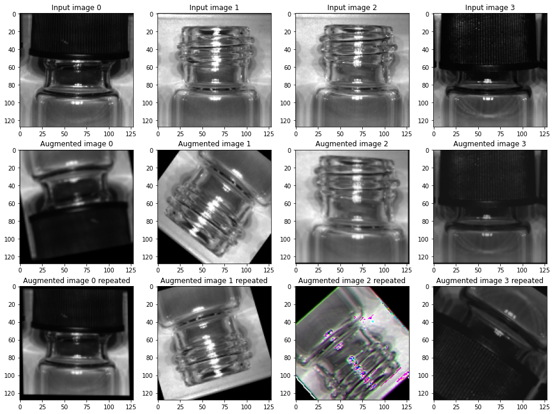

# Data science tools
The brevettiai python package has a series of tools for handling data, and, not least, images. They are described in the following section
# Brevetti AI Dataset
The dataset object can be used to manage listing of data (and access, if it where not publicly available)


```python
from brevettiai.platform.models.dataset import Dataset
ds = Dataset(name="My Test Dataset", bucket=dataset_path)

# Fix to get access to a public bucket without credentials
ds.io.minio.client_factory("s3://public.data.criterion.ai", lambda **x:{"endpoint": "s3-eu-west-1.amazonaws.com"})

samples = ds.get_image_samples()
# Printing content of a sample from the pandas data frame
print("Sample: ", samples.sample(1).iloc[0].to_dict())
```

    Sample:  {'category': ('good',), 'folder': 'good', 'path': 's3://public.data.criterion.ai/data/NeurIPS_2018_reduced/good/34_1543412107295.bmp', 'etag': '766d48aed39a3fd11f1a6b75190325f7', 'bucket': 's3://public.data.criterion.ai/data/NeurIPS_2018_reduced', 'dataset': 'My Test Dataset', 'dataset_id': '9390a735-27b1-4df6-81f6-dec8938a8b18', 'reference': 'N/A', 'url': 'https://platform.brevetti.ai/download?path=data%2FNeurIPS_2018_reduced%2Fgood%2F34_1543412107295.bmp'}


Samples now holds the image samples in a pandas dataframe object. We can e.g. investigate the distribution of the different classes


```python
samples.groupby("folder").count()
```


<div>

<table border="1" class="dataframe">
  <thead>
    <tr style="text-align: right;">
      <th></th>
      <th>category</th>
      <th>path</th>
      <th>etag</th>
      <th>bucket</th>
      <th>dataset</th>
      <th>dataset_id</th>
      <th>reference</th>
      <th>url</th>
    </tr>
    <tr>
      <th>folder</th>
      <th></th>
      <th></th>
      <th></th>
      <th></th>
      <th></th>
      <th></th>
      <th></th>
      <th></th>
    </tr>
  </thead>
  <tbody>
    <tr>
      <th>bad_cap</th>
      <td>22</td>
      <td>22</td>
      <td>22</td>
      <td>22</td>
      <td>22</td>
      <td>22</td>
      <td>22</td>
      <td>22</td>
    </tr>
    <tr>
      <th>good</th>
      <td>146</td>
      <td>146</td>
      <td>146</td>
      <td>146</td>
      <td>146</td>
      <td>146</td>
      <td>146</td>
      <td>146</td>
    </tr>
    <tr>
      <th>missing_cap</th>
      <td>12</td>
      <td>12</td>
      <td>12</td>
      <td>12</td>
      <td>12</td>
      <td>12</td>
      <td>12</td>
      <td>12</td>
    </tr>
  </tbody>
</table>
</div>


# Sample split - sample integrity module
## Sample Integrity
The brevettiai package uses AWS etags \(Usually MD5 checksums\), and file MD5 checksums as method of sample integrity checking. This allows fast listing of identities via the s3 list bucket api for most object, and s3 file metadata storage for the rest.

With the MD5 checksums it is possible to alert the user to duplicate samples, and to ensure that duplicates are used for the same purpose \(training/development/test\).

## Sample split
Functionality to split samples between training and **development** sets (often referred to as *validation* set, but this name is confusing in a regulated environment)

This module allows for more fine grained control of the splitting process than what is provided by e.g. sklearn.
The main feature is that it can split based on *unique* samples rather than just randomly. This is important when multiple images of the same physical item are available
* uniqueness
* stratification


```python
from brevettiai.data.sample_integrity import SampleSplit
from IPython.display import display 

uniqueness_regex = r"/(\d*)_\d*.bmp"

samples = SampleSplit(stratification=["folder"], uniqueness=uniqueness_regex, split=0.8, seed=42).assign(samples, remainder="devel")
print("Devel samples")
display(samples[samples["purpose"] == "devel"][:5].path.values)
print("Train samples")
display(samples[samples["purpose"] == "train"][:5].path.values)

samples.groupby(["folder", "purpose"]).count()
```

    Devel samples


    array(['s3://public.data.criterion.ai/data/NeurIPS_2018_reduced/bad_cap/2_1543413180595.bmp',
           's3://public.data.criterion.ai/data/NeurIPS_2018_reduced/bad_cap/2_1543413190226.bmp',
           's3://public.data.criterion.ai/data/NeurIPS_2018_reduced/bad_cap/5_1543413258015.bmp',
           's3://public.data.criterion.ai/data/NeurIPS_2018_reduced/bad_cap/5_1543413267597.bmp',
           's3://public.data.criterion.ai/data/NeurIPS_2018_reduced/bad_cap/6_1543413181402.bmp'],
          dtype=object)


    Train samples


    array(['s3://public.data.criterion.ai/data/NeurIPS_2018_reduced/bad_cap/0_1543413169486.bmp',
           's3://public.data.criterion.ai/data/NeurIPS_2018_reduced/bad_cap/0_1543413189854.bmp',
           's3://public.data.criterion.ai/data/NeurIPS_2018_reduced/bad_cap/10_1543413182213.bmp',
           's3://public.data.criterion.ai/data/NeurIPS_2018_reduced/bad_cap/10_1543413191789.bmp',
           's3://public.data.criterion.ai/data/NeurIPS_2018_reduced/bad_cap/1_1543413257224.bmp'],
          dtype=object)


<div>

<table border="1" class="dataframe">
  <thead>
    <tr style="text-align: right;">
      <th></th>
      <th></th>
      <th>category</th>
      <th>path</th>
      <th>etag</th>
      <th>bucket</th>
      <th>dataset</th>
      <th>dataset_id</th>
      <th>reference</th>
      <th>url</th>
    </tr>
    <tr>
      <th>folder</th>
      <th>purpose</th>
      <th></th>
      <th></th>
      <th></th>
      <th></th>
      <th></th>
      <th></th>
      <th></th>
      <th></th>
    </tr>
  </thead>
  <tbody>
    <tr>
      <th rowspan="2" valign="top">bad_cap</th>
      <th>devel</th>
      <td>6</td>
      <td>6</td>
      <td>6</td>
      <td>6</td>
      <td>6</td>
      <td>6</td>
      <td>6</td>
      <td>6</td>
    </tr>
    <tr>
      <th>train</th>
      <td>16</td>
      <td>16</td>
      <td>16</td>
      <td>16</td>
      <td>16</td>
      <td>16</td>
      <td>16</td>
      <td>16</td>
    </tr>
    <tr>
      <th rowspan="2" valign="top">good</th>
      <th>devel</th>
      <td>28</td>
      <td>28</td>
      <td>28</td>
      <td>28</td>
      <td>28</td>
      <td>28</td>
      <td>28</td>
      <td>28</td>
    </tr>
    <tr>
      <th>train</th>
      <td>118</td>
      <td>118</td>
      <td>118</td>
      <td>118</td>
      <td>118</td>
      <td>118</td>
      <td>118</td>
      <td>118</td>
    </tr>
    <tr>
      <th rowspan="2" valign="top">missing_cap</th>
      <th>devel</th>
      <td>2</td>
      <td>2</td>
      <td>2</td>
      <td>2</td>
      <td>2</td>
      <td>2</td>
      <td>2</td>
      <td>2</td>
    </tr>
    <tr>
      <th>train</th>
      <td>10</td>
      <td>10</td>
      <td>10</td>
      <td>10</td>
      <td>10</td>
      <td>10</td>
      <td>10</td>
      <td>10</td>
    </tr>
  </tbody>
</table>
</div>


# Data generator and stratified sampler
The brevettiai DataGenerator object is a generator object that extents the functionality of tensorflow datasets by adding
* a generated random seed to the map function, so that an image augmentation pipeline may produce reproducible results
* the possibility for stratified sampling such that samples can be drawn with controlled freqeuncy from different groups of the dataset

the method get_dataset() returns a tensorflow dataset object with the above mentioned properties


```python
from brevettiai.data.data_generator import StratifiedSampler, DataGenerator

batch_size = 4
# creating a data generator with stratification across a grouping on "folder" and with a weight determined by the square root of number of samples
generator = StratifiedSampler(batch_size=batch_size, groupby=["folder"], group_weighing="logx+1", seed=3)\
        .get(samples, shuffle=True, repeat=True)

for sample in generator.get_dataset().take(2):
    print(sample["path"])
```

    WARNING:tensorflow:From /opt/hostedtoolcache/Python/3.7.12/x64/lib/python3.7/site-packages/brevettiai/data/data_generator.py:177: sample_from_datasets_v2 (from tensorflow.python.data.experimental.ops.interleave_ops) is deprecated and will be removed in a future version.
    Instructions for updating:
    Use `tf.data.Dataset.sample_from_datasets(...)`.


    2022-03-03 14:10:18.868990: W tensorflow/stream_executor/platform/default/dso_loader.cc:64] Could not load dynamic library 'libcuda.so.1'; dlerror: libcuda.so.1: cannot open shared object file: No such file or directory; LD_LIBRARY_PATH: /opt/hostedtoolcache/Python/3.7.12/x64/lib/python3.7/site-packages/cv2/../../lib64:/opt/hostedtoolcache/Python/3.7.12/x64/lib
    2022-03-03 14:10:18.869028: W tensorflow/stream_executor/cuda/cuda_driver.cc:269] failed call to cuInit: UNKNOWN ERROR (303)
    2022-03-03 14:10:18.869048: I tensorflow/stream_executor/cuda/cuda_diagnostics.cc:156] kernel driver does not appear to be running on this host (fv-az214-164): /proc/driver/nvidia/version does not exist
    2022-03-03 14:10:18.869328: I tensorflow/core/platform/cpu_feature_guard.cc:151] This TensorFlow binary is optimized with oneAPI Deep Neural Network Library (oneDNN) to use the following CPU instructions in performance-critical operations:  AVX2 AVX512F FMA
    To enable them in other operations, rebuild TensorFlow with the appropriate compiler flags.


    tf.Tensor(
    [b's3://public.data.criterion.ai/data/NeurIPS_2018_reduced/bad_cap/0_1543413169486.bmp'
     b's3://public.data.criterion.ai/data/NeurIPS_2018_reduced/missing_cap/4_1543412687736.bmp'
     b's3://public.data.criterion.ai/data/NeurIPS_2018_reduced/missing_cap/5_1543412764666.bmp'
     b's3://public.data.criterion.ai/data/NeurIPS_2018_reduced/good/19_1543412104314.bmp'], shape=(4,), dtype=string)
    tf.Tensor(
    [b's3://public.data.criterion.ai/data/NeurIPS_2018_reduced/bad_cap/1_1543413266824.bmp'
     b's3://public.data.criterion.ai/data/NeurIPS_2018_reduced/good/23_1543412095468.bmp'
     b's3://public.data.criterion.ai/data/NeurIPS_2018_reduced/good/9_1543412102294.bmp'
     b's3://public.data.criterion.ai/data/NeurIPS_2018_reduced/bad_cap/2_1543413180595.bmp'], shape=(4,), dtype=string)


The data generator uses stratified sampling across a grouping on "folder" and with a weight determined by the square root of number of samples.
We can investigate the frequency of samples vs the frequency of actual samples in the dataset


```python
import pandas as pd
from itertools import islice
drawn_samples = pd.DataFrame(islice(generator.get_dataset_numpy(batch=False), len(samples)))
print("Data generator sample frequency")
drawn_samples.groupby("folder").count()
```

    Data generator sample frequency


<div>

<table border="1" class="dataframe">
  <thead>
    <tr style="text-align: right;">
      <th></th>
      <th>category</th>
      <th>path</th>
      <th>etag</th>
      <th>bucket</th>
      <th>dataset</th>
      <th>dataset_id</th>
      <th>reference</th>
      <th>url</th>
      <th>purpose</th>
      <th>_sampling_group</th>
    </tr>
    <tr>
      <th>folder</th>
      <th></th>
      <th></th>
      <th></th>
      <th></th>
      <th></th>
      <th></th>
      <th></th>
      <th></th>
      <th></th>
      <th></th>
    </tr>
  </thead>
  <tbody>
    <tr>
      <th>bad_cap</th>
      <td>45</td>
      <td>45</td>
      <td>45</td>
      <td>45</td>
      <td>45</td>
      <td>45</td>
      <td>45</td>
      <td>45</td>
      <td>45</td>
      <td>45</td>
    </tr>
    <tr>
      <th>good</th>
      <td>103</td>
      <td>103</td>
      <td>103</td>
      <td>103</td>
      <td>103</td>
      <td>103</td>
      <td>103</td>
      <td>103</td>
      <td>103</td>
      <td>103</td>
    </tr>
    <tr>
      <th>missing_cap</th>
      <td>32</td>
      <td>32</td>
      <td>32</td>
      <td>32</td>
      <td>32</td>
      <td>32</td>
      <td>32</td>
      <td>32</td>
      <td>32</td>
      <td>32</td>
    </tr>
  </tbody>
</table>
</div>


# Image pipeline
The ImagePipeline object is a utility for
* reading a wide range of image formats and adding the reader to the tensorflow dataset graph
* (optionally) select region(s) of interest
* (optionally) rescale / pad the image to the desired output shape


```python
from brevettiai.data.image.image_pipeline import ImagePipeline

pipeline = ImagePipeline(target_size=(128, 128))
img_generator = generator.map(pipeline)

#The image generator now adds the loaded (and reshaped) image to the dataset execution graph, and per default the output is added using the "img" key

imgs_gen = next(iter(img_generator))
# imgs_gen now holds samples with an added image
```

    WARNING:tensorflow:From /opt/hostedtoolcache/Python/3.7.12/x64/lib/python3.7/site-packages/tensorflow/python/util/deprecation.py:616: calling map_fn_v2 (from tensorflow.python.ops.map_fn) with dtype is deprecated and will be removed in a future version.
    Instructions for updating:
    Use fn_output_signature instead


# Image augmentation
Primarily based on the tensorflow augmentation options this api provides an augmentation pipeline that produces repeatable result. It provides two major types of augmentations

* transformation augmentation (e.g. flip / rotate / sheare)
* image noise augmentation

Uses a seed so output is repeatable


```python
from brevettiai.data.image.image_augmenter import ImageAugmenter
img_aug = ImageAugmenter()
img_generator_aug = img_generator.map(img_aug)
imgs_aug = next(iter(img_generator_aug))
# The img_generator_aug produces repeatable samples, so taking the first batch a second time, should produce identical output
imgs_aug_repeated = next(iter(img_generator_aug))
```

## Drawing the same sample twice produces the same augmented images


```python
import tensorflow as tf
import numpy as np
from matplotlib import pyplot as plt

fig, ax = plt.subplots(3, batch_size, figsize=(16, 12))
for ii in range(batch_size):
    ax[0, ii].imshow(tf.cast(imgs_gen["img"][ii], tf.uint8))
    ax[0, ii].set_title(f"Input image {ii}")
    ax[1, ii].imshow(tf.cast(imgs_aug["img"][ii], tf.uint8))
    ax[1, ii].set_title(f"Augmented image {ii}")
    ax[2, ii].imshow(tf.cast(imgs_aug_repeated["img"][ii], tf.uint8))
    ax[2, ii].set_title(f"Augmented image {ii} repeated")

```


    

    


To explore the code by examples, please run the in the notebook that can be found on colab on this link [3 Brevettiai Data Science Tools](https://githubtocolab.com/brevettiai/brevettiai-docs/blob/master/src/developers/python-sdk-brevettiai/3_brevettiai_data_science_tools.ipynb)