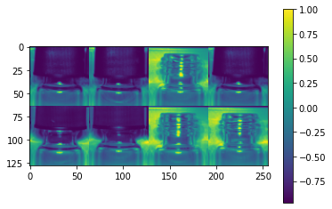
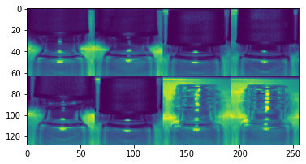
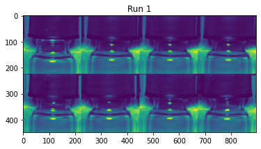
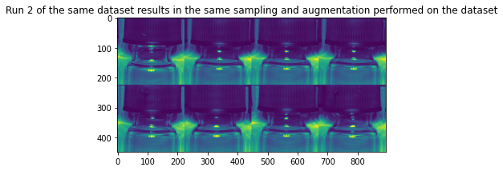

#  Accessing datasets and downloading samples
Samples in a dataset can be accessed via the dataset objects in a platform job object. Access rights are managed seamlessly.

Sample integrity and purpose management can be done easily through the sample integrity module, which splits the samples for test and training, taking duplicates, stratification, etc. into account


```python
from brevettiai.platform import get_image_samples
samples = get_image_samples(job.datasets)
```

    INFO:brevettiai.platform.dataset:Getting image samples from dataset 'NeurIPS vials TRAIN' [https://platform.brevetti.ai/data/cb14b6e3-b4b9-45bb-955f-47aa6489a192]
    INFO:brevettiai.platform.dataset:Contents: {('missing_cap',): 20, ('good',): 20, ('failed_cap',): 19, ('unknown',): 1}


```python
from brevettiai.data.sample_integrity import SampleSplit
samples = SampleSplit().update_unassigned(samples, id_path=job.artifact_path("sample_identification.csv"))
```

    INFO:brevettiai.data.sample_integrity:Looking for previous train / development split
    INFO:brevettiai.data.sample_integrity:Using train / development split from run cached in artifacts


```python
samples.head(5)
```


<div>

<table border="1" class="dataframe">
  <thead>
    <tr style="text-align: right;">
      <th></th>
      <th>category</th>
      <th>folder</th>
      <th>path</th>
      <th>etag</th>
      <th>bucket</th>
      <th>dataset</th>
      <th>dataset_id</th>
      <th>url</th>
      <th>purpose</th>
    </tr>
  </thead>
  <tbody>
    <tr>
      <th>0</th>
      <td>(failed_cap,)</td>
      <td>failed_cap</td>
      <td>s3://data.criterion.ai/cb14b6e3-b4b9-45bb-955f...</td>
      <td>18082de95a667ad2b5c11c23deaf21c0</td>
      <td>s3://data.criterion.ai/cb14b6e3-b4b9-45bb-955f...</td>
      <td>NeurIPS vials TRAIN</td>
      <td>cb14b6e3-b4b9-45bb-955f-47aa6489a192</td>
      <td>https://platform.brevetti.ai/download?path=a.c...</td>
      <td>train</td>
    </tr>
    <tr>
      <th>1</th>
      <td>(failed_cap,)</td>
      <td>failed_cap</td>
      <td>s3://data.criterion.ai/cb14b6e3-b4b9-45bb-955f...</td>
      <td>419fc5612ae56336d02e0f375f742dbe</td>
      <td>s3://data.criterion.ai/cb14b6e3-b4b9-45bb-955f...</td>
      <td>NeurIPS vials TRAIN</td>
      <td>cb14b6e3-b4b9-45bb-955f-47aa6489a192</td>
      <td>https://platform.brevetti.ai/download?path=a.c...</td>
      <td>devel</td>
    </tr>
    <tr>
      <th>2</th>
      <td>(failed_cap,)</td>
      <td>failed_cap</td>
      <td>s3://data.criterion.ai/cb14b6e3-b4b9-45bb-955f...</td>
      <td>775b42ac52b75ed04b55f28ed66405b6</td>
      <td>s3://data.criterion.ai/cb14b6e3-b4b9-45bb-955f...</td>
      <td>NeurIPS vials TRAIN</td>
      <td>cb14b6e3-b4b9-45bb-955f-47aa6489a192</td>
      <td>https://platform.brevetti.ai/download?path=a.c...</td>
      <td>train</td>
    </tr>
    <tr>
      <th>3</th>
      <td>(failed_cap,)</td>
      <td>failed_cap</td>
      <td>s3://data.criterion.ai/cb14b6e3-b4b9-45bb-955f...</td>
      <td>f3c08ff44efd25d37ff1247f6c18e552</td>
      <td>s3://data.criterion.ai/cb14b6e3-b4b9-45bb-955f...</td>
      <td>NeurIPS vials TRAIN</td>
      <td>cb14b6e3-b4b9-45bb-955f-47aa6489a192</td>
      <td>https://platform.brevetti.ai/download?path=a.c...</td>
      <td>train</td>
    </tr>
    <tr>
      <th>4</th>
      <td>(failed_cap,)</td>
      <td>failed_cap</td>
      <td>s3://data.criterion.ai/cb14b6e3-b4b9-45bb-955f...</td>
      <td>5dfab5b9037abb99b0a17b073d7dcf2e</td>
      <td>s3://data.criterion.ai/cb14b6e3-b4b9-45bb-955f...</td>
      <td>NeurIPS vials TRAIN</td>
      <td>cb14b6e3-b4b9-45bb-955f-47aa6489a192</td>
      <td>https://platform.brevetti.ai/download?path=a.c...</td>
      <td>train</td>
    </tr>
  </tbody>
</table>
</div>


## Loading datasets
File operations can be performed via the io_tools object. This object manages access of local and remote resources across windows and linux platforms. along with local cachin of files etc.


```python
# io_tools is accessible from the job object or directly via import 'from brevettiai.io import io_tools'
# Note that access rights are configured on the IoTools object, and as such different instances of the object
# does not neccesarily have access to the same files. 
io_tools = job.io
buf = io_tools.read_file(samples.path[0])
buf[:10]
```


    b'BM6L\x02\x00\x00\x00\x00\x00'


```python
# Set caching of remote objects globally for all operations on the IoTools object
io_tools.set_cache_root(job.temp_path("cache", dir=True))
# Or as a key in the read_file method
```

## Loading image data with tensorflow datasets
Samples may be easily loaded into tensorflow datasets with the **DataGenerator** class. **DataGenerator** contains a lot of functionality out of the box. Among others to sample, shuffle and seed your data generation.


```python
from brevettiai.data.data_generator import StratifiedSampler, DataGenerator, OneHotEncoder
from brevettiai.data.image import ImagePipeline, ImageAugmenter, SegmentationLoader

ds = StratifiedSampler().get(samples, shuffle=True, batch_size=8, output_structure=("path", "folder"))
```

The DataGenerator has four methods to iterate over data.

First returning tensorflow datasets:

* `get_samples()` returning the dataset sampled, but with no mapping
* `get_dataset()` returning the dataset sampled and mapped

Likewise `get_samples_numpy()` and `get_dataset_numpy()` returning numpy iterators


```python
# Return Data Geneator as tensorflow dataset objects to loop over samples or "img" and "category"
ds.get_samples(), ds.get_dataset()
```


    (<BatchDataset shapes: {category: (None, None), folder: (None,), path: (None,), etag: (None,), bucket: (None,), dataset: (None,), dataset_id: (None,), url: (None,), purpose: (None,)}, types: {category: tf.string, folder: tf.string, path: tf.string, etag: tf.string, bucket: tf.string, dataset: tf.string, dataset_id: tf.string, url: tf.string, purpose: tf.string}>,
     <PrefetchDataset shapes: ((None,), (None,)), types: (tf.string, tf.string)>)


```python
# Get iterator of numpy objects
ds.get_samples_numpy(), ds.get_dataset_numpy()
```


    (<brevettiai.data.tf_utils.NumpyStringIterator at 0x7fb5781e8cd0>,
     <brevettiai.data.tf_utils.NumpyStringIterator at 0x7fb5781ed750>)


As tensorflow datasets, you can map the dataset with functions.
Among premade functions are ImagePipeline, ImageAugmenter, OneHotEncoder and AnnotationParser


```python
ds = DataGenerator(samples, shuffle=True, batch_size=8, output_structure=("img", "onehot"))
ds = ds.map(ImagePipeline(target_size=(64,64), antialias=True, rescale="imagenet")) \
    .map(OneHotEncoder(samples.folder.unique(), output_key="onehot"))

# Use the structure change the default structure of the ouput
ds.get_dataset(structure=("path", "img", "onehot"))
```

    WARNING:tensorflow:From /opt/hostedtoolcache/Python/3.7.9/x64/lib/python3.7/site-packages/tensorflow/python/util/deprecation.py:574: calling map_fn_v2 (from tensorflow.python.ops.map_fn) with dtype is deprecated and will be removed in a future version.
    Instructions for updating:
    Use fn_output_signature instead


    <PrefetchDataset shapes: ((None,), (None, None, None, None), (None, 4)), types: (tf.string, tf.float32, tf.float32)>


```python
from brevettiai.data.image.utils import tile2d
import matplotlib.pyplot as plt

# Use structure=None to access all the dataset elements
x = next(ds.get_dataset_numpy(structure=None))
plt.imshow(tile2d(x["img"], (2,4))[...,0])
plt.colorbar()
```


    <matplotlib.colorbar.Colorbar at 0x7fb55b7ddf50>


    

    


```python
# Use structure="img" to get just the image
x = next(ds.get_dataset_numpy(structure="img"))
plt.imshow(tile2d(x, (2,4))[...,0])
```


    <matplotlib.image.AxesImage at 0x7fb57817fd90>


    

    


Using `build_image_data_generator` makes a simple dataset, combining loading, augmentation and onehot encoding og categories, and returning an (image, onehot) tuple which may be used directly as input to keras.


```python
from brevettiai.data.data_generator import build_image_data_generator
ds = build_image_data_generator(samples, batch_size=8, image=dict(target_size=(224, 224), antialias=True, rescale="imagenet"))
```

The standard modules of TfDataset are deterministic and randomness may be seeded. Thus multiple runs of the same dataset object will result in the same output sequence. By application of the `seed` parameter, this can be true across multiple similar TfDataset objects.


```python
from brevettiai.data.data_generator import build_image_data_generator
ds = build_image_data_generator(samples, batch_size=8, image=dict(target_size=(224, 224), antialias=True, rescale="imagenet"))
x = next(ds.get_dataset_numpy())
plt.figure()
plt.title("Run 1")
plt.imshow(tile2d(x[0], (2,4))[...,0])
plt.figure()
plt.title("Run 2 of the same dataset results in the same sampling and augmentation performed on the dataset")
x = next(ds.get_dataset_numpy())
plt.imshow(tile2d(x[0], (2,4))[...,0])
```


    <matplotlib.image.AxesImage at 0x7fb55b35c990>


    

    


    

    

