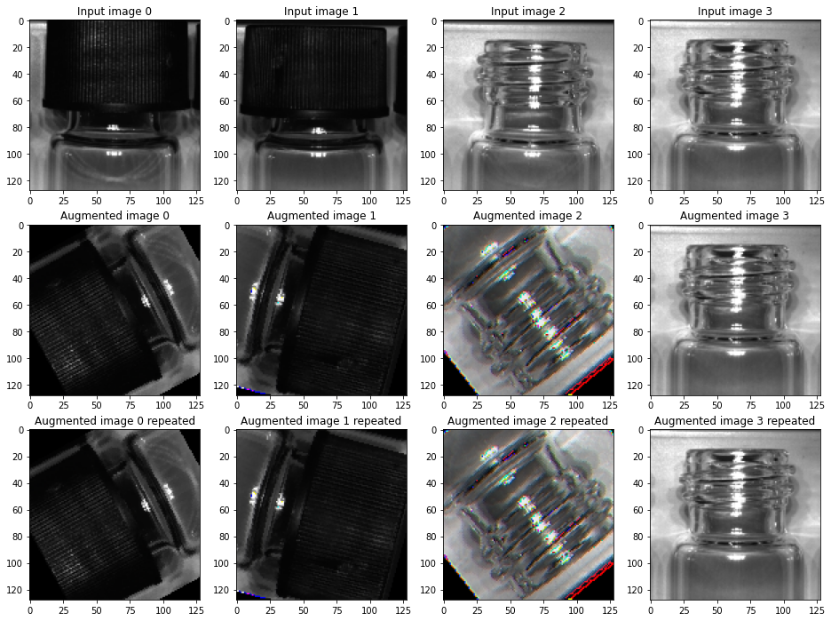

# Brevetti AI package installation

Install brevettiai using the pip package manager. Simply uncomment the
```
# !pip install ...
```
line below to install/update the brevettiai package if applicable.on e.g. colab


```python
#!pip install -U git+https://bitbucket.org/criterionai/core
import brevettiai
help(brevettiai)
```

    Help on package brevettiai:
    
    NAME
        brevettiai
    
    PACKAGE CONTENTS
        data (package)
        interfaces (package)
        io (package)
        platform (package)
        tests (package)
        utils (package)
    
    FILE
        /opt/hostedtoolcache/Python/3.7.9/x64/lib/python3.7/site-packages/brevettiai/__init__.py
    
    


# Get images from public dataset
Load publicly available dataset


```python
use_dataset = "brevetti_neurips_images"
if use_dataset == "brevetti_neurips_images":
    dataset_path = "s3://public.data.criterion.ai/data/NeurIPS_2018_reduced"
elif use_dataset == "tensorflow_flowers":
    import tensorflow as tf
    dataset_path = str(tf.keras.utils.get_file(
        'flower_photos',
        'https://storage.googleapis.com/download.tensorflow.org/example_images/flower_photos.tgz',
        untar=True))
elif use_dataset == "tensorflow_datasets_beans":
    import tensorflow_datasets as tfds
    batch_size = 4

    ds = tfds.load("beans", split="test", shuffle_files=False)

    def encode(x):
        x["encoded"] = tf.io.encode_png(x["image"])
        return x
    def map2float(x):
        x["image"] = tf.cast(x["image"], tf.float32)
        return x
    img_ds = ds.map(encode).map(map2float)
    imgs = next(iter(img_ds.batch(batch_size).take(1)))
    files = []
    for ii in range(batch_size):
        files.append({"path": f"image_{ii}.png"})
        print(f'Writing file {files[-1]["path"]}')
        tf.io.write_file(files[-1]["path"], img["encoded"][ii])

    import pandas as pd
    files = pd.DataFrame(files)

```

## Create Brevetti AI Dataset object to manage listing of data (and access, if it where not publicly available)


```python
from brevettiai.platform.dataset import Dataset
ds = Dataset(bucket=dataset_path, resolve_access_rights=False)

# Fix to get access to a public bucket without credentials
ds.io.minio.client_factory("s3://public.data.criterion.ai", lambda **x:{"endpoint": "s3-eu-west-1.amazonaws.com"})

samples = ds.get_image_samples()
# Printing content of a sample from the pandas data frame
print("Sample: ", samples.sample(1).iloc[0].to_dict())
```

    CV2 not available


    Sample:  {'category': ('good',), 'folder': 'good', 'path': 's3://public.data.criterion.ai/data/NeurIPS_2018_reduced/good/28_1543412106084.bmp', 'etag': '4373c527d575bc0290bcd3702abb55b7', 'bucket': 's3://public.data.criterion.ai/data/NeurIPS_2018_reduced', 'dataset': '', 'dataset_id': '', 'url': 'https://platform.brevetti.ai/download?path=lic.data.criterion.ai%2Fdata%2FNeurIPS_2018_reduced%2Fgood%2F28_1543412106084.bmp'}


samples now holds the image samples in a pandas dataframe object. We can investigate the distribution of the different classes


```python
samples.groupby("folder").count()
```


<div>
<style scoped>
    .dataframe tbody tr th:only-of-type {
        vertical-align: middle;
    }

    .dataframe tbody tr th {
        vertical-align: top;
    }

    .dataframe thead th {
        text-align: right;
    }
</style>
<table border="1" class="dataframe">
  <thead>
    <tr style="text-align: right;">
      <th></th>
      <th>category</th>
      <th>path</th>
      <th>etag</th>
      <th>bucket</th>
      <th>dataset</th>
      <th>dataset_id</th>
      <th>url</th>
    </tr>
    <tr>
      <th>folder</th>
      <th></th>
      <th></th>
      <th></th>
      <th></th>
      <th></th>
      <th></th>
      <th></th>
    </tr>
  </thead>
  <tbody>
    <tr>
      <th>bad_cap</th>
      <td>22</td>
      <td>22</td>
      <td>22</td>
      <td>22</td>
      <td>22</td>
      <td>22</td>
      <td>22</td>
    </tr>
    <tr>
      <th>good</th>
      <td>146</td>
      <td>146</td>
      <td>146</td>
      <td>146</td>
      <td>146</td>
      <td>146</td>
      <td>146</td>
    </tr>
    <tr>
      <th>missing_cap</th>
      <td>12</td>
      <td>12</td>
      <td>12</td>
      <td>12</td>
      <td>12</td>
      <td>12</td>
      <td>12</td>
    </tr>
  </tbody>
</table>
</div>


# Dataset split - sample integrity module
Functionality to split samples between training and development sets (often referred to as validation set, but this name is confusing in a regulated environment)

This module allows for more fine grained control of the splitting process than what is provided by e.g. sklearn.
The main feature is that it can split based on unique samples rather than just randomly. This is important when multiple images of the same physical item are available


```python
from brevettiai.data.sample_integrity import SampleSplit
from IPython.display import display 

uniqueness_regex = r"/(\d*)_\d*.bmp"

samples = SampleSplit(stratification=["folder"], uniqueness=uniqueness_regex, split=0.8, seed=42).assign(samples, remainder="devel")
print("Devel samples")
display(samples[samples["purpose"] == "devel"][:5].path.values)
print("Train samples")
display(samples[samples["purpose"] == "train"][:5].path.values)

samples.groupby(["folder", "purpose"]).count()
```

    Devel samples


    array(['s3://public.data.criterion.ai/data/NeurIPS_2018_reduced/bad_cap/2_1543413180595.bmp',
           's3://public.data.criterion.ai/data/NeurIPS_2018_reduced/bad_cap/2_1543413190226.bmp',
           's3://public.data.criterion.ai/data/NeurIPS_2018_reduced/bad_cap/5_1543413258015.bmp',
           's3://public.data.criterion.ai/data/NeurIPS_2018_reduced/bad_cap/5_1543413267597.bmp',
           's3://public.data.criterion.ai/data/NeurIPS_2018_reduced/bad_cap/6_1543413181402.bmp'],
          dtype=object)


    Train samples


    array(['s3://public.data.criterion.ai/data/NeurIPS_2018_reduced/bad_cap/0_1543413169486.bmp',
           's3://public.data.criterion.ai/data/NeurIPS_2018_reduced/bad_cap/0_1543413189854.bmp',
           's3://public.data.criterion.ai/data/NeurIPS_2018_reduced/bad_cap/10_1543413182213.bmp',
           's3://public.data.criterion.ai/data/NeurIPS_2018_reduced/bad_cap/10_1543413191789.bmp',
           's3://public.data.criterion.ai/data/NeurIPS_2018_reduced/bad_cap/1_1543413257224.bmp'],
          dtype=object)


<div>
<style scoped>
    .dataframe tbody tr th:only-of-type {
        vertical-align: middle;
    }

    .dataframe tbody tr th {
        vertical-align: top;
    }

    .dataframe thead th {
        text-align: right;
    }
</style>
<table border="1" class="dataframe">
  <thead>
    <tr style="text-align: right;">
      <th></th>
      <th></th>
      <th>category</th>
      <th>path</th>
      <th>etag</th>
      <th>bucket</th>
      <th>dataset</th>
      <th>dataset_id</th>
      <th>url</th>
    </tr>
    <tr>
      <th>folder</th>
      <th>purpose</th>
      <th></th>
      <th></th>
      <th></th>
      <th></th>
      <th></th>
      <th></th>
      <th></th>
    </tr>
  </thead>
  <tbody>
    <tr>
      <th rowspan="2" valign="top">bad_cap</th>
      <th>devel</th>
      <td>6</td>
      <td>6</td>
      <td>6</td>
      <td>6</td>
      <td>6</td>
      <td>6</td>
      <td>6</td>
    </tr>
    <tr>
      <th>train</th>
      <td>16</td>
      <td>16</td>
      <td>16</td>
      <td>16</td>
      <td>16</td>
      <td>16</td>
      <td>16</td>
    </tr>
    <tr>
      <th rowspan="2" valign="top">good</th>
      <th>devel</th>
      <td>28</td>
      <td>28</td>
      <td>28</td>
      <td>28</td>
      <td>28</td>
      <td>28</td>
      <td>28</td>
    </tr>
    <tr>
      <th>train</th>
      <td>118</td>
      <td>118</td>
      <td>118</td>
      <td>118</td>
      <td>118</td>
      <td>118</td>
      <td>118</td>
    </tr>
    <tr>
      <th rowspan="2" valign="top">missing_cap</th>
      <th>devel</th>
      <td>2</td>
      <td>2</td>
      <td>2</td>
      <td>2</td>
      <td>2</td>
      <td>2</td>
      <td>2</td>
    </tr>
    <tr>
      <th>train</th>
      <td>10</td>
      <td>10</td>
      <td>10</td>
      <td>10</td>
      <td>10</td>
      <td>10</td>
      <td>10</td>
    </tr>
  </tbody>
</table>
</div>


# Data generator
The brevettiai DataGenerator object is a generator object that extents the functionality of tensorflow datasets by adding
* a generated random seed to the map function, so that an image augmentation pipeline may produce reproducible results
* the possibility for stratified sampling such that samples can be drawn with controlled freqeuncy from different groups of the dataset

the method get_dataset() returns a tensorflow dataset object with the above mentioned properties


```python
from brevettiai.data.data_generator import StratifiedSampler

batch_size = 4
# creating a data generator with stratification across a grouping on "folder" and with a weight determined by the square root of number of samples
generator = StratifiedSampler(batch_size=batch_size, groupby=["folder"], group_weighing="square root").get(samples, shuffle=True, repeat=True, seed=0)

for sample in generator.get_dataset().take(2):
    print(sample["path"])
```

    tf.Tensor(
    [b's3://public.data.criterion.ai/data/NeurIPS_2018_reduced/good/12_1543412160501.bmp'
     b's3://public.data.criterion.ai/data/NeurIPS_2018_reduced/good/31_1543412097087.bmp'
     b's3://public.data.criterion.ai/data/NeurIPS_2018_reduced/good/10_1543412092892.bmp'
     b's3://public.data.criterion.ai/data/NeurIPS_2018_reduced/good/20_1543412104513.bmp'], shape=(4,), dtype=string)
    tf.Tensor(
    [b's3://public.data.criterion.ai/data/NeurIPS_2018_reduced/bad_cap/1_1543413266824.bmp'
     b's3://public.data.criterion.ai/data/NeurIPS_2018_reduced/missing_cap/5_1543412764666.bmp'
     b's3://public.data.criterion.ai/data/NeurIPS_2018_reduced/good/24_1543412105328.bmp'
     b's3://public.data.criterion.ai/data/NeurIPS_2018_reduced/good/46_1543412109676.bmp'], shape=(4,), dtype=string)


The data generator uses stratified sampling across a grouping on "folder" and with a weight determined by the square root of number of samples.
We can investigate the frequency of samples vs the frequency of actual samples in the dataset


```python
import pandas as pd
from itertools import islice
drawn_samples = pd.DataFrame(islice(generator.get_dataset_numpy(batch=False), len(samples)))
print("Data generator sample frequency")
drawn_samples.groupby("folder").count()
```

    Data generator sample frequency


<div>
<style scoped>
    .dataframe tbody tr th:only-of-type {
        vertical-align: middle;
    }

    .dataframe tbody tr th {
        vertical-align: top;
    }

    .dataframe thead th {
        text-align: right;
    }
</style>
<table border="1" class="dataframe">
  <thead>
    <tr style="text-align: right;">
      <th></th>
      <th>category</th>
      <th>path</th>
      <th>etag</th>
      <th>bucket</th>
      <th>dataset</th>
      <th>dataset_id</th>
      <th>url</th>
      <th>purpose</th>
      <th>_sampling_group</th>
    </tr>
    <tr>
      <th>folder</th>
      <th></th>
      <th></th>
      <th></th>
      <th></th>
      <th></th>
      <th></th>
      <th></th>
      <th></th>
      <th></th>
    </tr>
  </thead>
  <tbody>
    <tr>
      <th>bad_cap</th>
      <td>45</td>
      <td>45</td>
      <td>45</td>
      <td>45</td>
      <td>45</td>
      <td>45</td>
      <td>45</td>
      <td>45</td>
      <td>45</td>
    </tr>
    <tr>
      <th>good</th>
      <td>102</td>
      <td>102</td>
      <td>102</td>
      <td>102</td>
      <td>102</td>
      <td>102</td>
      <td>102</td>
      <td>102</td>
      <td>102</td>
    </tr>
    <tr>
      <th>missing_cap</th>
      <td>33</td>
      <td>33</td>
      <td>33</td>
      <td>33</td>
      <td>33</td>
      <td>33</td>
      <td>33</td>
      <td>33</td>
      <td>33</td>
    </tr>
  </tbody>
</table>
</div>


# Image pipeline
The ImagePipeline object is a utility for
* reading a wide range of image formats and adding the reader to the tensorflow dataset graph
* (optionally) select region(s) of interest
* (optionally) rescale / pad the image to the desired output shape


```python
from brevettiai.data.image.image_pipeline import ImagePipeline

pipeline = ImagePipeline(target_size=(128, 128))
img_generator = generator.map(pipeline)

#The image generator now adds the loaded (and reshaped) image to the dataset execution graph, and per default the output is added using the "img" key

imgs_gen = next(iter(img_generator))
# imgs_gen now holds samples with an added image
```

    WARNING:tensorflow:From /opt/hostedtoolcache/Python/3.7.9/x64/lib/python3.7/site-packages/tensorflow/python/util/deprecation.py:574: calling map_fn_v2 (from tensorflow.python.ops.map_fn) with dtype is deprecated and will be removed in a future version.
    Instructions for updating:
    Use fn_output_signature instead


# Image augmentation
* transformation augmentation (e.g. flip / rotate / sheare)
* image noise augmentation

Uses a seed so output is repeatable


```python
from brevettiai.data.image.image_augmenter import ImageAugmenter
img_aug = ImageAugmenter()
img_generator_aug = img_generator.map(img_aug)
imgs_aug = next(iter(img_generator_aug))
# The img_generator_aug produces repeatable samples, so taking the first batch a second time, should produce identical output
imgs_aug_repeated = next(iter(img_generator_aug))
```

## Drawing the same sample twice produces the same augmented images


```python
import tensorflow as tf
import numpy as np
from matplotlib import pyplot as plt

fig, ax = plt.subplots(3, batch_size, figsize=(16, 12))
for ii in range(batch_size):
    ax[0, ii].imshow(tf.cast(imgs_gen["img"][ii], tf.uint8))
    ax[0, ii].set_title(f"Input image {ii}")
    ax[1, ii].imshow(tf.cast(imgs_aug["img"][ii], tf.uint8))
    ax[1, ii].set_title(f"Augmented image {ii}")
    ax[2, ii].imshow(tf.cast(imgs_aug_repeated["img"][ii], tf.uint8))
    ax[2, ii].set_title(f"Augmented image {ii} repeated")

```


    

    

